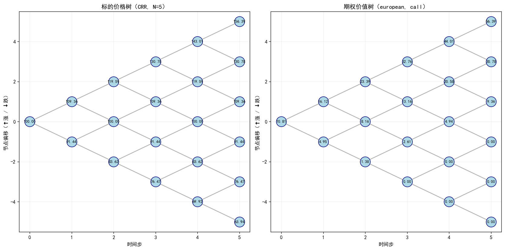
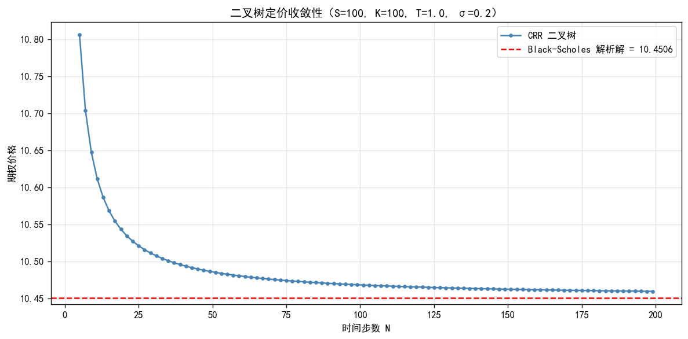
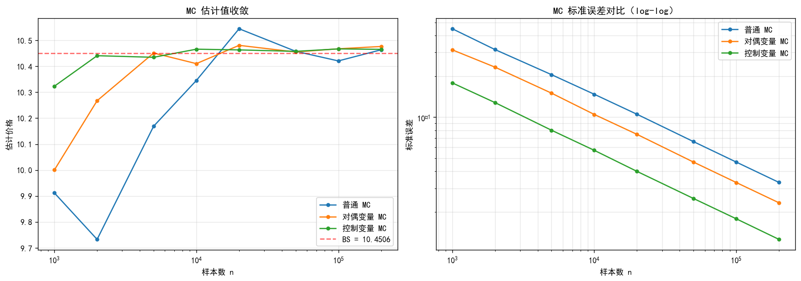
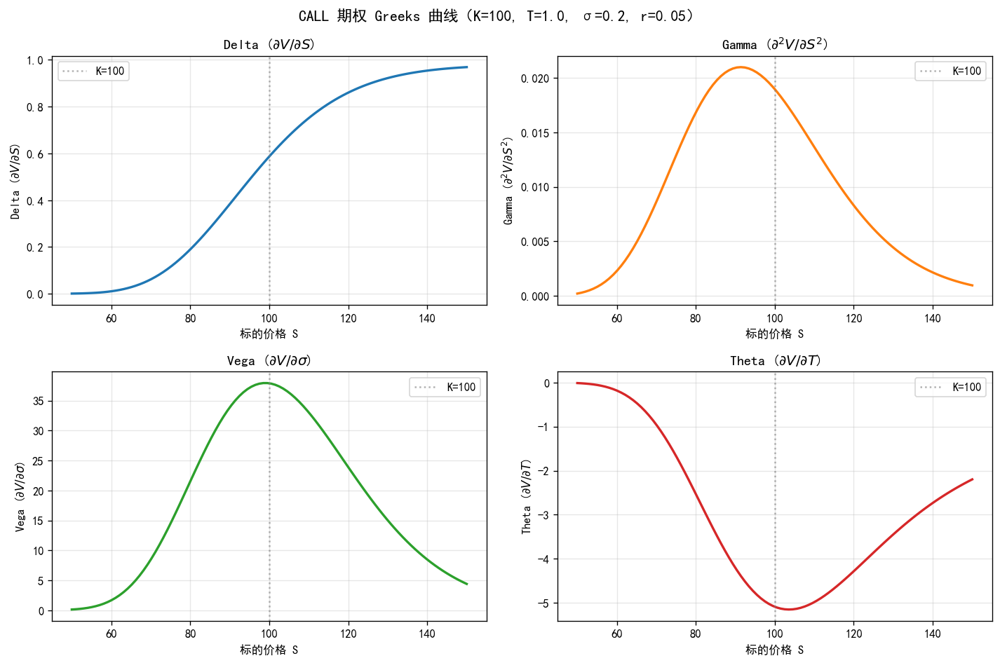

# OptionPricer —— 期权定价工具包

> 纯 Python 实现的期权定价库：解析解 / 树方法 / 蒙特卡洛，含 Greeks 与隐含波动率求解。

一个用纯 Python 实现的香草期权定价工具包，涵盖 **Black-Scholes 解析解 / CRR 二叉树 / Boyle 三叉树 / 蒙特卡洛模拟（含方差缩减）** 四类定价方法，并提供 **希腊字母（Greeks）** 与 **隐含波动率（IV）** 求解。从闭式解到数值方法，覆盖衍生品定价的核心算法谱系，代码模块化、零重型依赖、附完整单元测试。

---

## 一、项目背景

期权（Option）作为最重要的金融衍生品之一，其定价问题是量化金融的基石。1973 年 Black-Scholes 公式的诞生奠定了现代衍生品市场的理论基础；而对于无解析解的美式期权与奇异期权，业界依赖**树定价**与**蒙特卡洛模拟**等数值算法。

本项目把经典的数据结构与算法（树结构、动态规划、数值求根、复杂度分析）落地到一个真实的金融场景，做到：

* **对算法的工程化实现**——不仅会用，更要会写；
* **对算法选型的权衡分析**——同一个问题为何要有多种解法；
* **对收敛性与数值稳定性的实证**——理论分析与数值实验互相印证。

---

## 二、核心算法与实现要点

| 模块 | 核心数据结构 / 算法 | 涉及领域 |
| --- | --- | --- |
| `black_scholes.py`  | 数值计算（`math.erf` 实现 N(x)） | 基础数值方法 |
| `binomial_tree.py`  | **二叉树（数组实现的完全二叉树） + 动态规划** | 树、DP、最优停时 |
| `trinomial_tree.py` | **三叉树（重组树） + DP** | 树结构推广 |
| `monte_carlo.py`    | **蒙特卡洛 + 方差缩减（对偶变量、控制变量）** | 随机化算法、统计方法 |
| `greeks.py`         | **有限差分法（中心差分 O(h²)）** | 数值微分 |
| `implied_vol.py`    | **牛顿迭代法（平方收敛） + 二分法（鲁棒兜底）** | 求根算法、复合策略 |
| `visualizer.py`     | matplotlib 可视化 | 工程能力 |

### 关键算法亮点

#### 1. 二叉树定价的空间优化

CRR 二叉树是 **"重组树"（recombining tree）**，即 `u·d = 1`，因此 N 步树虽然有 `(N+1)(N+2)/2` 个节点，但每一层只有 `n+1` 个不同节点。**用一维数组原地更新**就能完成回溯，把空间复杂度从 O(N²) 压缩到 O(N)，时间仍是 O(N²)。这是"用数组实现完全二叉树"这一经典技巧的直接应用。

#### 2. 美式期权的动态规划求解

美式期权可以在到期前任意时刻行权，本质是一个**最优停时（Optimal Stopping）问题**，其离散化形式正是**贝尔曼方程**：

```
V(n, i) = max( payoff(S_{n,i}),                          ← 立即行权
               e^(-rΔt) · [p·V(n+1, i+1) + (1-p)·V(n+1, i)] )   ← 继续持有
```

从叶子节点的 payoff 出发，**自底向上**回溯到根节点，是典型的"最优子结构 + 自底向上 DP"。

#### 3. 蒙特卡洛的方差缩减

普通蒙特卡洛的标准误差按 O(1/√n) 衰减，要把误差减半需要 4 倍样本。本项目实现两种经典方差缩减技术：

* **对偶变量法（Antithetic Variates）**：每次抽样 Z 后同时使用 -Z，构造一对**负相关**样本，方差严格减小；
* **控制变量法（Control Variates）**：用 `S_T` 作为控制变量（其折现期望为 `S·e^(-qT)` 已知），构造修正估计 `X' = X - β(Y - E[Y])`，其中 `β = Cov(X,Y)/Var(Y)`。

实验上控制变量法的标准误差约为普通 MC 的 **1/3**（见 `docs/screenshots/convergence_mc.png`）。

#### 4. 隐含波动率的复合求根策略

IV 求解是工程实践中"高阶方法 + 鲁棒兜底"模式的典型应用：

1. 先用 **牛顿迭代法**（用 Vega 作为导数）平方收敛快速逼近；
2. 若 Vega 接近 0 或迭代越界，自动切换到 **二分法**（线性收敛但绝对稳定）。

这种设计兼顾**性能**（牛顿法 5-10 次迭代到 1e-8 精度）与**鲁棒性**（极端参数下不发散）。

---

## 三、项目结构

```
OptionPricer/
├── src/                          # 核心源代码
│   ├── option.py                 # 期权对象（dataclass）
│   ├── black_scholes.py          # Black-Scholes 解析解 + Greeks
│   ├── binomial_tree.py          # CRR 二叉树定价（欧式 + 美式）
│   ├── trinomial_tree.py         # Boyle 三叉树定价
│   ├── monte_carlo.py            # 蒙特卡洛 + 方差缩减
│   ├── greeks.py                 # Greeks（解析 / 差分）
│   ├── implied_vol.py            # 隐含波动率求解
│   └── visualizer.py             # 可视化
├── tests/                        # 单元测试（unittest，19 个用例）
│   ├── test_black_scholes.py     # Put-Call Parity、Hull 教科书例题
│   ├── test_trees.py             # 树定价收敛性、Merton 定理
│   ├── test_monte_carlo.py       # 置信区间、方差缩减效果
│   └── test_implied_vol.py       # 往返一致性测试
├── examples/                     # 演示脚本
│   ├── pricing_demo.py           # 四种定价方法对照
│   ├── convergence_demo.py       # 树定价 + MC 收敛性可视化
│   └── greeks_demo.py            # Greeks + IV 演示
├── docs/                         # 文档与截图
│   ├── algorithms.md             # 算法详解
│   ├── theory.md                 # 金融理论背景
│   └── screenshots/              # 演示图片
├── README.md                     # 本文件
├── LICENSE                       # MIT License
├── requirements.txt              # 依赖清单
└── .gitignore
```

---

## 四、运行指南

### 1. 环境要求

* Python ≥ 3.9
* numpy ≥ 1.20
* matplotlib ≥ 3.5

### 2. 安装依赖

```bash
pip install -r requirements.txt
```

### 3. 运行测试（验证代码正确性）

```bash
python -m unittest discover -s tests -v
```

预期输出：`Ran 19 tests in ~0.1s   OK`

### 4. 运行演示

```bash
# 演示一：四种定价方法对照 + 美式期权
python examples/pricing_demo.py

# 演示二：收敛性可视化（生成 3 张图到 docs/screenshots/）
python examples/convergence_demo.py

# 演示三：Greeks + IV 求解
python examples/greeks_demo.py
```

### 5. 在自己代码里调用

```python
from src import Option, OptionType, ExerciseStyle
from src import bs_price, binomial_price, mc_price_control_variate, implied_volatility

# 定义一个欧式 Call 期权
opt = Option(S=100, K=100, T=1.0, r=0.05, sigma=0.20,
             option_type=OptionType.CALL, style=ExerciseStyle.EUROPEAN)

# 三种方法定价对比
print("BS  =", bs_price(opt))                                  # 10.4506
print("Tree=", binomial_price(opt, steps=500))                 # 10.4466
print("MC  =", mc_price_control_variate(opt, n_paths=100000))  # (10.466, 0.018)

# 反解隐含波动率
iv = implied_volatility(opt, market_price=10.4506)
print("IV  =", iv)                                             # 0.20000000
```

---

## 五、运行截图

### 5.1 N=5 二叉树展开（教学示意）

左侧标的价格树、右侧期权价值树，根节点价值即为期权价。



### 5.2 二叉树定价随步数收敛到 BS 解析价



### 5.3 蒙特卡洛三种方法的标准误对比（log-log 图斜率均为 -1/2）



### 5.4 Greeks 关于标的价 S 的曲线



---

## 六、关键实验结果

### 6.1 多方法定价对比（S=100, K=100, T=1, r=5%, σ=20%, Call）

| 方法 | 价格 | 误差（vs BS） | 耗时 |
| --- | ---: | ---: | ---: |
| Black-Scholes 解析解 | 10.450584 | — | 0.017 ms |
| CRR 二叉树 (N=500) | 10.446585 | 4.0e-3 | 7.97 ms |
| Boyle 三叉树 (N=500) | 10.446603 | 4.0e-3 | 21.48 ms |
| 普通 MC (n=100k) | 10.420541 | std=0.047 | 12.51 ms |
| 对偶变量 MC (n=100k) | 10.467314 | std=0.033 | 1.53 ms |
| 控制变量 MC (n=100k) | 10.466844 | **std=0.018** | 3.74 ms |

### 6.2 美式 Put 的提前行权溢价

参数：S=100, K=110（in-the-money put）, T=1, r=5%, σ=30%

* 欧式 Put = 14.660553
* 美式 Put = 15.622203
* **提前行权溢价 = 0.961651 (6.56%)**

### 6.3 Merton 定理验证

无股息时美式 Call 等于欧式 Call（提前行权永远不优）：差额 = 0.00e+00 ✓

---

## 七、开发说明

本项目的**整体架构、算法选型与核心实现**——包括二叉树自底向上 DP 回溯、三叉树参数化、蒙特卡洛方差缩减（对偶变量 / 控制变量）、隐含波动率的牛顿-二分复合求根——均由作者独立设计与实现。

开发过程中使用 **Claude（Anthropic）** 辅助生成部分样板代码、可视化脚本与文档排版，所有 AI 辅助内容均经过人工审阅、重构与测试验证（19 个单元测试 100% 通过，覆盖 Put-Call Parity、Merton 定理、收敛性与方差缩减效果等关键性质）。

---

## 八、参考资料

1. Hull, J. C. *Options, Futures, and Other Derivatives*, 10th Edition. Pearson, 2017.
2. Cox, J. C., Ross, S. A., & Rubinstein, M. (1979). *Option pricing: A simplified approach*. Journal of Financial Economics.
3. Boyle, P. P. (1986). *Option valuation using a three-jump process*. International Options Journal.
4. Glasserman, P. *Monte Carlo Methods in Financial Engineering*. Springer, 2003.
5. Kamrad, B., & Ritchken, P. (1991). *Multinomial Approximating Models for Options with k State Variables*. Management Science.

---

## 九、许可

本项目采用 [MIT License](LICENSE) 开源，欢迎学习与二次创作。
